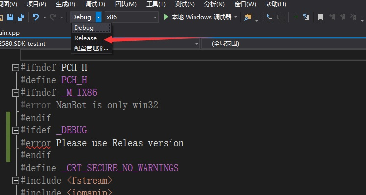

# c++实例


### 请使用VS2017及以上版本进行开发

## 文件说明

```c++
/*

//调用的json库
#CJsonObject.hpp
#CJsonObject.cpp
#cJSON.h
#cJSON.c


//sdk封装
##sdk.h
##sdk.cpp

//结构体
##struct.h

//常量表
##DEF.h

//预编译
##pch.h

//DLL导出文件
##Source.def

//在这个文件编辑代码
##main.cpp


*/


```


## 设置插件信息

- 在方法 `GenerateInfo` 下设置插件信息

  1.基础信息

  ```c++ 
  	json["info"].Add("name","测试");					//插件名称
  
  	json["info"].Add("author","test");				//插件作者
  
  	json["info"].Add("verindex","1.0");				//插件内部版本
  
  	json["info"].Add("vername","1.0");				//插件显示版本
  
  	json["info"].Add("id","net.nanbot.hj2580.SDK_test");//插件ID
  	//插件文件名必须以 插件ID.nt.dll 进行命名，以上例子的文件名就应为 net.nanbot.hj2580.SDK_test.nt.dll
  
  	json["info"].Add("url","");// 请输入HTTP地址，当用户点击“联系作者”后会跳转到该地址 
  	//此项尚未启用，填不填关系不大
  
  	json["info"].Add("describe","这是一个测试插件");
  	// 支持HTML和多行
  	json["info"].Add("priority", NanBot_PRIORITY_GIVE);//插件优先级，1为优先，2为正常，3为滞后
  	 
  	json["info"].Add("bg","");
  // 显示的背景图片文件名，请在初始化中将背景图片写到 “\webui\imgs\”文件夹中；如“net.nanbot.test.jpg”
  
  
  ```

  2.事件信息

  ```c++
  	json["event"].Add("group", true);		//群事件 
  	json["event"].Add("frame",true);		//框架和插件事件 
  	json["event"].Add("verify",true);		//验证事件 
  	json["event"].Add("friend",true);		//好友事件 
  	json["event"].Add("provisional",true);	//临时事件 
  	json["event"].Add("other",true);		//其他事件 
  	json["event"].Add("public",true);		//公众号事件
  
  ```

  3.权限信息

  ```c++
  	json["auth"] 	.Add("group",true);    //群操作
  	json["auth"]	.Add("message",true);  //消息操作
  	json["auth"]	.Add("baseinfo",true); //基础信息获取
  	json["auth"]	.Add("maininfo",true); //敏感信息获取
  	json["auth"]	.Add("frame",true);	   //框架插件操作
  	json["auth"]	.Add("verify",true);   //验证消息操作
  	json["auth"]	.Add("robot",true);	   //机器人自身操作
  	json["auth"]	.Add("wallet",true);   //钱包操作
  ```

  ~~~cpp
  //事件权限中 true 代表“启用”，  false 代表“禁用”
  ~~~

  

  # 编写代码

  ### 群消息示例

  ```cpp
  
  int _stdcall Event_Group(int type, text parameter) {
  
  		switch (type)
  		{
  		case EVENT_GROUP_TEXTMSG: {
  			json j;
  			j.Parse(parameter);
  			string qq = j("qq");
  			string group = j("group");
  			string msgId = j("msgId");
  			string msgNo = j("msgNo");
  			string msg = j("msg");
  			if(!strcmp(msg.c_str(),"你好")){
                  nt.SendMsg(stoull(group.c_str()), MSGFORMAT_TEXT, "你好", 2, 0);
                  
                  
              }
              
              
              
  			break; }
  		
  		}
  		default:
  			break;
  	
  	return 1;
  }
  
  ```

  ## 插件打包

  按Ctrl+shift+B

  或者生成->生成解决方案

  ## 错误说明

  1.NanBot is only win32	

  ~~~cpp
  //	C1189	#error:  NanBot is only win32	
  
  ~~~

  ### 解决方法

  

2.

```c
C4996	'sprintf': This function or variable may be unsafe. Consider using sprintf_s instead. To disable deprecation, use _CRT_SECURE_NO_WARNINGS	

```

### 	解决方法


3.

```c
C1189	#error:  Please use Releas version	

```

### 	解决方法

